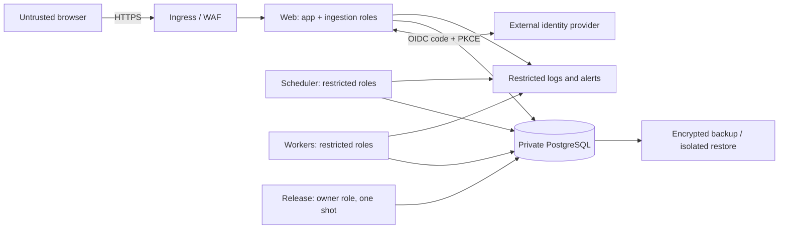

# Deployment threat model

This is the baseline threat model for a synthetic-data staging deployment. The deployment owner must update it with selected-provider controls, network diagrams and accountable people before review.

## Assets and trust boundaries

Protected assets are source content, canonical context, relationship and hypothesis state, identity mappings, session and CSRF secrets, provider credentials, database credentials and security audit history.

The internet-to-ingress, ingress-to-web, application-to-database, application-to-identity-provider, runtime-to-secret-store and database-to-backup transitions are separate trust boundaries. Credentials must not cross into a process that does not need them.

## Priority threats and controls

| Threat                                      | Current application control                                                                       | Deployment evidence still required                                   |
| ------------------------------------------- | ------------------------------------------------------------------------------------------------- | -------------------------------------------------------------------- |
| Forged user/workspace/role                  | Exact OIDC verification; server-owned subject mapping; production rejects demo identity           | Provider configuration, MFA and real login tests                     |
| Stolen/replayed browser session             | Opaque hashed session, browser binding, idle/absolute expiry, revocation, secure host-only cookie | TLS termination review and logout/replay test                        |
| Cross-site request or script injection      | Exact-origin CSRF, double-submit token, framing denial, per-response script nonce CSP             | Ingress header preservation and penetration test                     |
| Permission leakage                          | Database-enforced RLS, permission-filtered retrieval/graph, leakage suites                        | Restored-role verification and real connector scope mapping review   |
| Privilege escalation through credentials    | Owner credential isolated to release; non-owning app/ingest roles; startup validation             | Secret-store policies, workload identities and private network proof |
| Migration tampering or concurrency          | Advisory lock, transaction per migration, immutable checksum ledger                               | Release logs, image digest and backup before release                 |
| Malicious or poisoned source content        | Immutable source versions, provenance, untrusted discovery inbox and steward gate                 | Connector input limits, malware/content policy and operator playbook |
| Model/provider data disclosure              | Offline default, allow-listed routing/budgets, permissioned packet only                           | Provider contract, retention/residency settings and egress controls  |
| Denial of service or runaway cost           | Actor limits, bounded pools/workers/load harness and model budgets                                | WAF/login limits, platform quotas, alerts and measured workload      |
| Lost/corrupt database                       | Forward-only recovery policy and read-only restore verifier                                       | Automated backup/PITR evidence and measured RPO/RTO drill            |
| Audit destruction or secret leakage in logs | Append-only database events and content-safe structured runtime logs                              | External restricted sink, retention, redaction and access review     |
| Compromised dependency/image                | Lockfile, audit, pinned base image line and CI image builds                                       | Image scanning, digest promotion, update SLA and provenance policy   |

## Abuse cases to test

1. Send a valid provider token for an unlinked subject, a token with the wrong audience and a forged `x-demo-actor`; all must fail without naming a workspace.
2. Reuse revoked and expired sessions, omit/alter CSRF proof and send a cross-origin mutation; all must fail and create the expected audit signal.
3. Ask an actor about inaccessible client/project aliases; names, snippets, graph nodes, scores and source health must not leak.
4. Run concurrent releases and modify a previously applied migration in a test branch; the lock must serialise and the checksum must stop the altered history.
5. Stop scheduler/worker processes mid-job; leases and idempotency must prevent loss or duplicate durable outcomes after restart.
6. Exhaust rate, database and model budgets in staging; work must fail boundedly and alert without exposing content.

## Residual risk and release rule

Application tests cannot validate cloud IAM, DNS, TLS termination, WAF rules, provider tenancy, backup retention or the people operating them. Staging must remain synthetic-only until the provider-specific diagram and evidence are attached, the manual acceptance list passes, the recovery drill meets agreed RPO/RTO, and an independent reviewer accepts or explicitly records every residual high-risk item.
