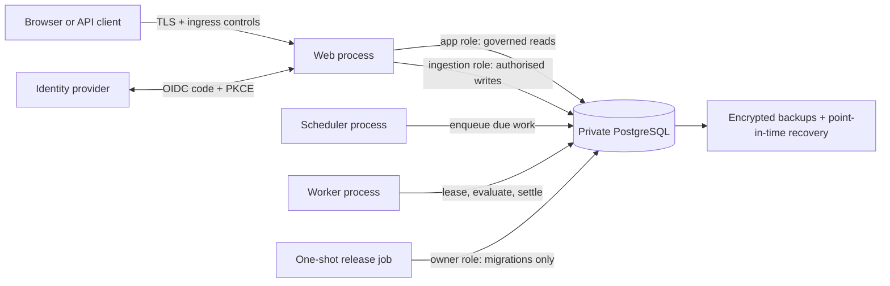

# Production operations and recovery contract

Milestone 15 packages the application as four independently controlled processes. It is a portable deployment contract, not a live cloud deployment.



The owner database credential exists only in the one-shot release job. Web, worker and scheduler startup fails if that credential is present. Their application and ingestion URLs must use dedicated users, non-disposable passwords, a non-loopback host and `sslmode=require`, `verify-ca` or `verify-full`.

## Container targets

The multi-stage `Dockerfile` exposes:

- `web`: minimal Next.js standalone output, non-root user and liveness probe;
- `operations`: TypeScript worker/scheduler runtime under the unprivileged Node user; and
- `release`: one-shot production configuration validation and database migration.

The production Compose contract adds a read-only filesystem, no Linux capabilities, `no-new-privileges`, bounded temporary storage and a 30-second shutdown grace period. It binds the web port to loopback so an operator must deliberately place a TLS reverse proxy or platform ingress in front of it.

## Deployment sequence

1. Provision PostgreSQL 18 with pgvector on a private network. Create encrypted automated backups and point-in-time recovery before applying migrations.
2. Store database URLs, generated role passwords, OIDC client material and optional provider keys in the platform secret manager. Do not use an `.env` file in the deployed image.
3. Build immutable `web` and `operations` images from the same commit and set `APP_COMMIT_SHA` to that full commit.
4. Run the `release` target once. It validates the isolated owner credential and applies idempotent forward migrations.
5. Start one scheduler replica, one or more worker replicas and the web replicas. Database leases and idempotency keys make multiple workers safe; start with one until workload measurements justify scaling.
6. Route traffic only after `/api/health/ready` returns 200. Keep `/api/health/live` for process liveness. Neither endpoint returns credentials, workspace data or dependency details on failure.
7. Configure the ingress for TLS, body-size limits, login-endpoint throttling, request IDs and central access logs. Do not expose PostgreSQL publicly.

The checked-in `docker-compose.production.yml` is a local orchestration example for validating this topology. Render it only with a private deployment environment file:

```bash
docker compose --env-file .env.production \
  -f docker-compose.production.yml config
docker compose --env-file .env.production \
  -f docker-compose.production.yml --profile release run --rm release
docker compose --env-file .env.production \
  -f docker-compose.production.yml up -d web worker scheduler
```

Never commit `.env.production`. Production-enforcement checks also run at web and operations startup, so supplying local hosts, disposable credentials, plaintext database transport or an owner URL to a runtime process causes startup to fail.

## Worker supervision

`operations:worker` continuously drains monitor and discovery queues. `operations:scheduler` periodically enqueues due work. Both:

- validate both restricted database connections before starting;
- reuse PostgreSQL `SKIP LOCKED` leases and existing idempotency contracts;
- avoid overlapping iterations inside a process;
- emit structured JSON without evidence content or credentials;
- keep running after an isolated iteration error so durable retry/dead-letter rules can act; and
- stop accepting new iterations on SIGTERM/SIGINT, wait for the active iteration and close both pools.

The initial intervals are two seconds for workers and sixty seconds for scheduling. Override them only after measuring queue latency and database load. Use `DATABASE_POOL_MAX` to bound each process pool between 1 and 32 connections.

## Monitoring and alerts

At minimum, alert on:

- readiness failures or repeated container restarts;
- dead-letter monitor/discovery jobs;
- critical notification-outbox entries;
- authentication or CSRF denial spikes;
- rate-limit denials;
- database connection saturation and storage growth;
- backup failure or replication/PITR lag; and
- scheduler silence beyond twice its configured interval.

Ship container logs and the security-audit JSONL export to a restricted central system with a defined retention policy. Application logs deliberately identify event type, process, duration and commit but exclude organisational evidence and token values.

## Rollback and recovery

Application images are immutable and may be rolled back to a previously healthy commit only when its code remains compatible with the current forward schema. SQL migrations are forward-only; do not improvise a destructive down migration during an incident.

Before every release:

1. confirm the latest backup and PITR window;
2. review migration compatibility with the previous application image;
3. test the release job in a staging database restored from a recent backup and run `npm run recovery:verify`; and
4. record the image digests and commit SHA.

For data corruption or an incompatible migration, stop writers, preserve the affected database for investigation, restore into a new isolated database to the selected recovery point, validate permissions and readiness, then switch application secrets/traffic. Test that procedure periodically; an untested backup is not a recovery capability.

## Still external to this repository

The operator must still choose and configure a cloud, DNS/TLS, WAF or ingress, managed PostgreSQL, secret manager, identity provider, central logging and alerting. Milestone 16 supplies bounded staging/load checks, a recovery verifier and a provider-completion threat model, but they have not run against a live environment. Provider-specific joiner/mover/leaver automation, external notification delivery, representative-scale load testing and independent penetration testing remain separate milestones.
